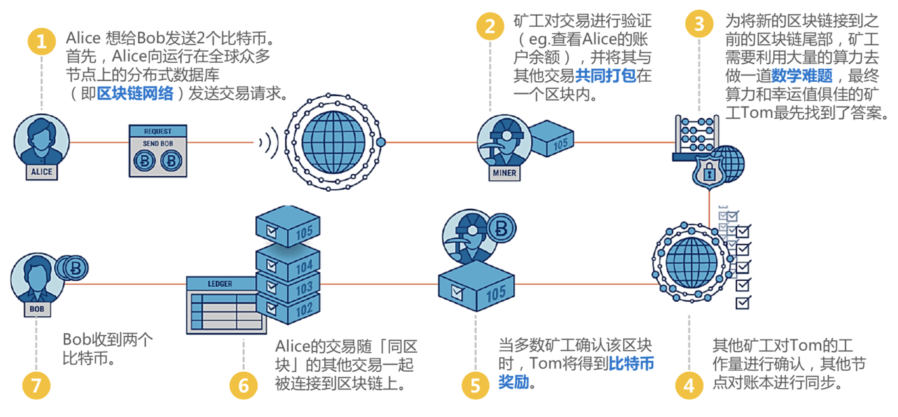
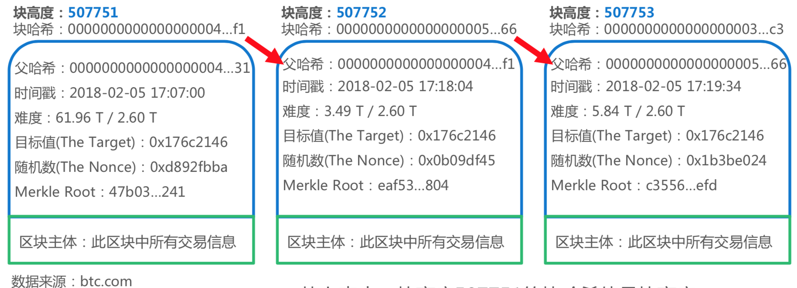
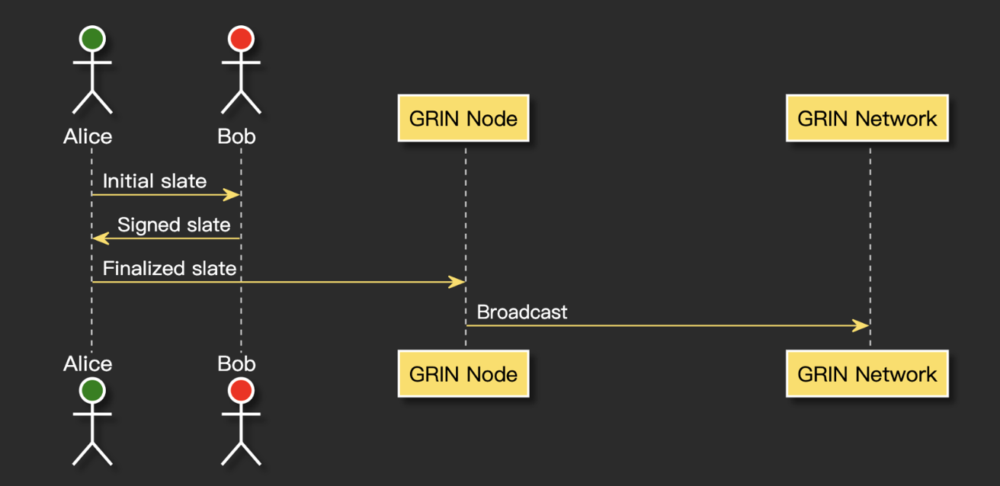

# 加密货币交易：基于共识的点对点交易

交易是商业的基础活动。在我们生活中每天都会接触，如衣食住行，社交和娱乐等。网络生活中也会经常发生，如知识付费，会员充值，游戏装备。

我们在生活中，总是有很多东西必须买买买，钱也总是不够用。
如果我们能对交易更有更多观察，变得更有意识，我们会更了解我们所处的世界。

## 交易过程和要素

我们初略想一想交易的过程：在门店中，商家提供商品，消费者使用货币来购买需要的商品。很容易会发现有这些要素：

- 门店，发生交易的场所；
- 商家，他负责打理商店，提供商品；
- 商品，满足/回应消费者的需求；
- 消费者，未满足的某需求；
- 货币，是交易媒介。

当我们在网店上购物，和线下门店有一些不一样了。回顾网上购物的交易过程：我在网站上看到某商品的促销广告，点击该广告链接查看详细商品信息，然后将商品添加到购物车，并且完成付款，等待快递送货短信通知，取货验收通过后，我会确认收货并评价，最终完成交易。

除了门店交易中的所涉及的要素：门店，商家，商品，消费者，货币，还包括：大量的信息，数据和算法。如：消费者画像，商品陈列SKU数据，物流基础数据，平台推荐算法，消费者搜索算法，物流配送效率算法等。 

可见，交易过程会随着不同的交易场景而变化，同时新的技术工具提供了交易场景新的可能性；

**区块链技术带来的新的交易场景是什么？** 

## 区块链交易过程

区块链的交易过程可以参考在2018年36Kr研究院的报告《区块链行业报告》中的一幅图：

这幅图以Alice向Bob发送比特币为例，从交易过程，我们也会发现交易双方-Alice和Bob，货币及金额-2个比特币。除了这些要素外，有哪些新的过程呢？

通过忽略大量中间环节，我们将过程简化为：发起交易-广播交易-达成共识-链接到区块链-交易完成；现在就有了三个问题：

- 为什么要广播交易？
- 如何达成共识？
- 区块链是什么？

## 基于共识的点对点交易

先忘掉比特币和区块链，我们来想象一些交易场景：

- Alice 给 Bob 付2美元；很简单，Alice直接交给Bob纸币；
- Alice 给 Bob 付200美元；稍微复杂一些，Alice将纸币交给Bob后，Bob会检查美元真假；
- Alice 给 Bob 付200万美元；会更复杂一些，Alice无法把200万纸币直接交给Bob，Bob也不放心直接收取200万纸币。

我们基于200万美元案例，想象一个带广播交易的场景：

Alice 是 Bob 的天使投资人，他因为某个原因，某种方式将200万美元交给Bob，然后双方签订合约，并且对外公布：Alice 作为 Bob初创项目的股权投资人 ，投资了200万美元换取Bob初创项目20%的股权。

Alice 和 Bob为什么要广播交易？因为Alice 想要与 Bob要建立一种风险极高的合作，签订合约后广播交易，引入更多见证人（比如律师），提高Bob的违约成本，从而降低合作的风险。

**为什么要广播交易？**引入更多见证人，降低达成合作所需的信任成本。

区块链的数据模型并不高深：区块+链；

区块主体是交易信息数据，把这些交易信息按时间先后连接起来形成区块链。对照我们的日常生活，我们可以把区块链的数据模型类比为通过点对点网络链接起来的账本系统。

回到200万的交易场景中，Alice 不会直接把200万纸币交给Bob，而是通过借助于银行，律所等机构，承担相应的交易成本，签订合约，完成交易。在这样的交易中，账本系统和合约是关键，一旦 Alice 或 Bob 某一方违约，银行，律所等中间机构会介入，查看账本系统和合约，违约方随后承担大家认定的违约成本。

**区块链是什么？**是不同见证人独立记录的账本系统。不借助银行，律所等中间机构，降低了交易成本；当交易完成或发生某方违约时，也能审查账本系统，通过智能合约对成本和收益做结算。

在200万的交易场景中，我们记录交易的账本系统和合约都具有中心化，唯一性的特点。中间机构一旦做恶，如账务作假或篡改数据，我们的财产权将无法得到保障。

因为不同见证人独立记账，一旦账本系统达成共识，那么篡改数据的成本就会变得极高。同时这也意味着我们不依赖于少数见证人的道德，不区分他诚实或恶意，而是假设每位见证人都按自己的意愿行动。在考虑他人可能的策略之后，采用一种策略最大化自己的回报。“诚实”的行为只是许多策略中的一种，在道德上并不依赖于此。

**如何达成共识？**通过设计共识协议和激励机制，大多数见证人的作恶的行为无法获得更高的回报，会保持诚实。我们经常听到的PoW，也称工作量证明，就是比特币的一种共识协议。

在交易中使用区块链可以引入更多见证人，降低达成合作的信任成本；通过共识机制，让不同见证人独立记录的账本系统保持一致；通过点对点网络链接起来的账本系统，不借助银行，律所等中间机构，降低了交易成本。

所以说：区块链是一种基于共识的点对点交易。其交易过程如下：发起交易-引入更多见证人-达成共识-不同见证人独立记录到账本系统-交易完成。

## 隐私型加密货币Grin案例

2019年隐私型加密货币的明星项目非Grin莫属。

Grin 的名字据信来自「Gringotts Wizarding Bank」，中译为古灵阁，在哈利波特一书中是「the only bank of the wizarding world」，意思是「魔法世界的唯一银行」。
Grin 继承了几乎所有令比特币如此强大的社会特性：匿名创始人、无领导的团队、PoW、无 ICO、无预挖矿、无开发税等。在 2016 年至 2018 年这三年间，正是 ICO 横行大把捞钱的时代，Grin 开发者们埋头研究和开发，成为近年来所有加密货币开发项目中最清贫的项目团队。

由图中可知Grin的交易过程也是：
发起交易-引入更多见证人-达成共识-不同见证人独立记录到账本系统-交易完成。

在日常生活中，我们会经常遇到一些场景：

- 达成合作的信任成本特别高；
- 中间机构产生非常高的交易成本；
- 一旦中间机构做恶，财产权将无法得到保障。

例如 **创业合伙** 就是是非常典型的场景，区块链的交易能够给我们的创业合伙带什么新的启发呢？
