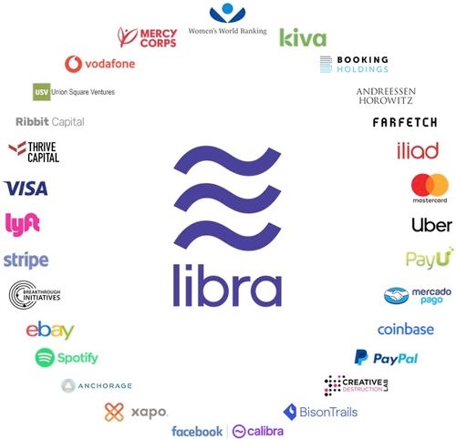
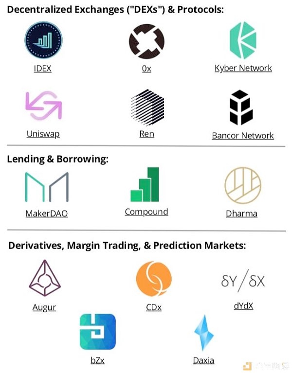
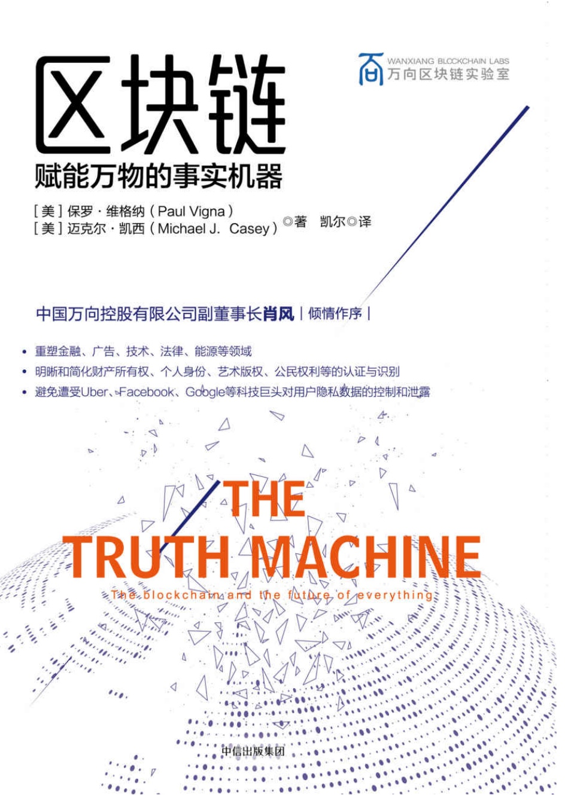

# 共读《区块链-赋能万物的事实机器》

2019年06月18日，Facebook 加密货币Libra的白皮书发布。

在白皮书的结语中写道：

Libra 的目标如下:在安全稳定的开源区块链基础上创建一种稳定的货币，该货币以真实资产储备为后盾，并由独立协会管理。
我们希望创造更完善、更实惠的开放式金融服务，人们不论身份、不论地域、不论职业、不论贫富，均可享受这种服务。我们深知，要实现这样的愿景将需要长久的艰辛努力，并且绝非一己之力可以完成，这将需要大家同心协力、脚踏实地地向前迈进。希望您能加入我们，协助我们将这一梦想变成现实，造福全球数十亿人。

## 开放式金融是什么？

开放式金融也称DeFi，是Decentralized Finance的缩写，概念指代那些在开放的去中心化网络中发展而出的各类金融领域的应用，目标是建立一个多层面的金融系统，以区块链技术和密码货币为基础，重新创造并完善已有的金融体系。

## 为什么关注开放式金融？

以拉美国家为例，其经济发展和收入水平普遍位于中至高等收入区间，人均GDP超过9000美金，却是世界上银行覆盖率最低的区域之一：成年人口近一半没有银行账户，只有41%拥有银行卡。除了零售银行业务的落后，企业银行信贷也不完善：拉美的商业形式中，中小企业占比达到90%以上，而据世界银行估算，这些中小企业的融资缺口超过1万亿美元。

为什么传统商业银行对市场的主流群体如此缺乏吸引力、效率如此低下？

首先是人们对银行体系的强烈不信任。80年代初的拉美债务危机过后，许多拉美国家开始执行一系列新自由主义的经济政策，导致国际市场上的“热钱”陆续涌入拉美。然而由于经济结构的脆弱和政府管理能力的缺乏，热钱来的容易，去的痛苦。20世纪90年代到21世纪初许多国家经历了银行业危机，不少商业银行相继倒闭。之后近10年的大宗商品涨价潮让拉美国家暂时度过了一段高增长的好时光。然而当大宗商品进入周期循环低谷，拉美的资源型经济立刻再度疲软，政府的调控不利和腐败，造成了阿根廷、巴西和委内瑞拉几大经济体的收缩，拉美地区在国际资本市场上吸引力减弱，不少国家再度遭受了货币贬值、通胀高企的打击。在这样剧烈波动的大环境下，加上时不时来一出的股市诈骗丑闻，民众对金融系统的痛恨可想而知。

另一方面，人们也反感传统银行的蛮横霸道。拉美的银行寡头现象严重，金融集团为各个国家的大家族所控，乱收费、手续繁杂、办事效率低下，完全不以用户为中心。开一个普通的存款账户不仅有最低存款要求，还要每个月缴纳管理费，ATM取现还要再收手续费。转账、支付、汇款、信用卡等等各种费用自然更是少不了。寡头垄断的另一恶果是缺乏竞争，银行只服务大企业和社会精英，根本没有动力去触达中小企业和普通人群。譬如，巴西的5所大银行掌控了整个国家95%的银行资产。即便在巴西经济2014年开始倒退和持续低迷的这些年，几大银行的净资产收益率（ROE）从未跌下过15.9%。最大的银行Itaú 2018年上半年的ROE高达20.1%，同期欧洲的银行ROE仅仅为个位数。

## 开放式金融和加密货币

在《区块链-赋能万物的事实机器》一书中写道：

在麻省理工学院的数字货币计划组织里，有一个国际项目正在进行当中，它的目标是开发出各国央行或政府可能会采用的法定数字货币的原型。这个项目的起点是一个名为Cryptokernel（简称CK，即加密核心）的区块链工具包。它是由这个数字货币计划组织的研究员詹姆斯·洛夫乔伊（James Lovejoy）创立的，让人们能够更容易对这项技术进行实验。而且它是开源软件，任何人都可以使用。罗布莱·阿里（Robleh Ali）是一位研究科学家，他曾是英国央行的一个开创性的数字货币计划的主导者，后来加入了麻省理工学院。据他所言，这个工具包很重要，因为它意味着“我们未来金融体系的设计，将能由任何地方的任何人来进行构思。如果能让更多的人参与这个项目中，就更可能开发出掌握在人民手中（而非银行）的真正的去中心化金融系统”。

这个工具包的首个应用是名为K320的实验性数字货币，它与比特币有很大区别。比特币的发行计划，是通过编码的方式，规定了到2140年最多能够挖出2100万个比特币；而K320的发行量并没有严格地固定下来。它的设计目标是，通过降低稀缺性这个因素来减少人们囤积这种加密货币的行为。对比特币进行囤积的做法愈演愈烈，让很多人认为比特币在社会中重要的功能是价值储存方式（数字黄金）而非用于日常交易的普通货币。社会需要人们将货币花费出去，而不是存储起来；而人们总是倾向于储蓄，部分原因是历史上长期存在的经济问题，我们见过最可怕的例子就是“大萧条”（1929—1933年）。为了避免这个结果，K320的发行机制是有着持续的温和通胀率的。

## 共读《区块链-赋能万物的事实机器》

在《区块链-赋能万物的事实机器》一书中写道：

区块链是一个社会性的技术，是一个关于如何治理社区的蓝图，这里所说的社区既包括在约旦某个荒凉的前哨里居住的惊恐万分的难民，也包括银行间市场（世界上最大的金融机构每天在其中的交易额达数万亿美元）。显然，若要让区块链技术走向正确的方向，需要社会各个方面的贡献。你可以将此视为号召，我们期望社会各界都关注并参与到这项技术的发展中。

基于区块链属于跨学科知识，我们需要跨领域的共读者，关注不同角度：

* 数学：加密学，共识算法；待定
* 经济和金融：货币，交易成本&效率；待定
* 会计和法律：产权，合同，监管，风险；Jack
* 历史：社会发展角度；待定
* IT工具：分布式账本技术；李端
* 行业应用：教育，医疗，供应链；待定

邀请您共读《区块链-赋能万物的事实机器》，关注并参与到这项社会性技术的发展中。
共读报名链接：https://www.wenjuan.com/s/RNraeac/
